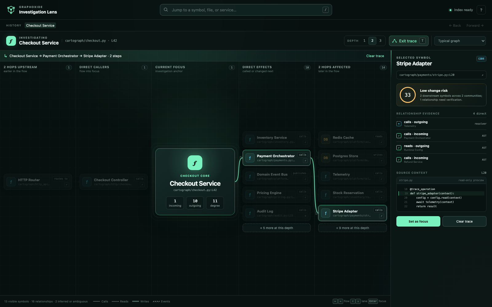

# Investigation Lens

Investigation Lens is a focus-plus-context graph concept for answering three
questions quickly:

1. What calls this symbol?
2. What does it affect?
3. Why does Graphoxide believe each relationship exists?

Instead of giving the full graph equal visual weight, the selected symbol stays
at the center of a left-to-right directed flow. Upstream callers appear to its
left, downstream effects appear to its right, and each additional hop gets a
collapsible column. Selecting a node exposes its source context, direct evidence,
confidence, and a deterministic change-risk cue in the inspector.



## Run it

From the repository root:

```bash
python3 -m http.server 4173
```

Then open:

```text
http://localhost:4173/design/graph-concepts/investigation-lens/
```

No build step, package install, network request, or new dependency is required.
The prototype consumes the read-only shared fixture at
`../shared/fixture.js`.

## Review the interaction model

- Select any card to inspect evidence; double-click it or press `Enter` to make
  it the new center.
- Use arrow keys to travel with the dependency flow or within one hop column.
- Press `/` to find symbols and files, `T` to trace impact or the selected path,
  `[` / `]` to change neighborhood depth, and `Backspace` to revisit history.
- Use the **Preview** menu to inspect dense, loading, and empty behavior.
- Click a “more at this depth” card to expand only that neighborhood column.

The same states can be linked directly with `?state=dense`, `?state=loading`, or
`?state=empty`. Review links may also set `depth=1..3`, `select=<node-id>`, and
`trace=1`; the screenshot below uses `?select=stripe-adapter&trace=1`.

Every graph card is a semantic button. Relationships combine labels, arrow
direction, and distinct line patterns so meaning does not depend on color.
Confidence uses text plus shapes (`✓`, `≈`, `?`). The stylesheet includes
high-contrast focus treatment, forced-colors support, a narrow-screen layout,
and a `prefers-reduced-motion` mode.

## Deliberate prototype boundaries

- Source previews and risk scores are deterministic presentation mock data
  derived from the shared topology; they are not proposed graph contract fields.
- “Open source” announces the intended host action because this standalone page
  has no VS Code bridge.
- The fixture is small enough for DOM/SVG rendering. A shipped implementation
  should retain the focused neighborhood limit instead of rendering the whole
  repository into the DOM.

## Validate

```bash
node --check design/graph-concepts/investigation-lens/app.js
node design/graph-concepts/investigation-lens/verify.mjs
node design/graph-concepts/shared/verify-fixture.mjs
```

`verify.mjs` checks that the runnable files and accessibility/state hooks remain
present and that the prototype references, rather than copies, the shared
fixture.

The checked-in `screenshot.png` was reproduced at 1600×1000 while the local
server was running:

```bash
"/Applications/Google Chrome.app/Contents/MacOS/Google Chrome" \
  --headless=new --hide-scrollbars --window-size=1600,1000 \
  --virtual-time-budget=1800 \
  --screenshot="design/graph-concepts/investigation-lens/screenshot.png" \
  "http://127.0.0.1:4173/design/graph-concepts/investigation-lens/?select=stripe-adapter&trace=1"
```
